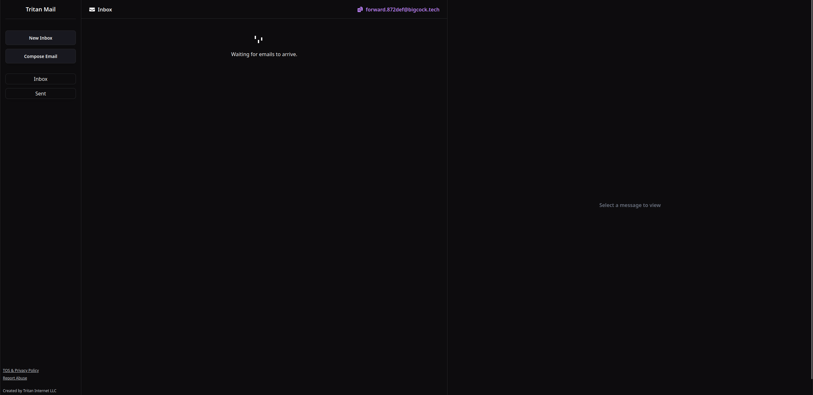
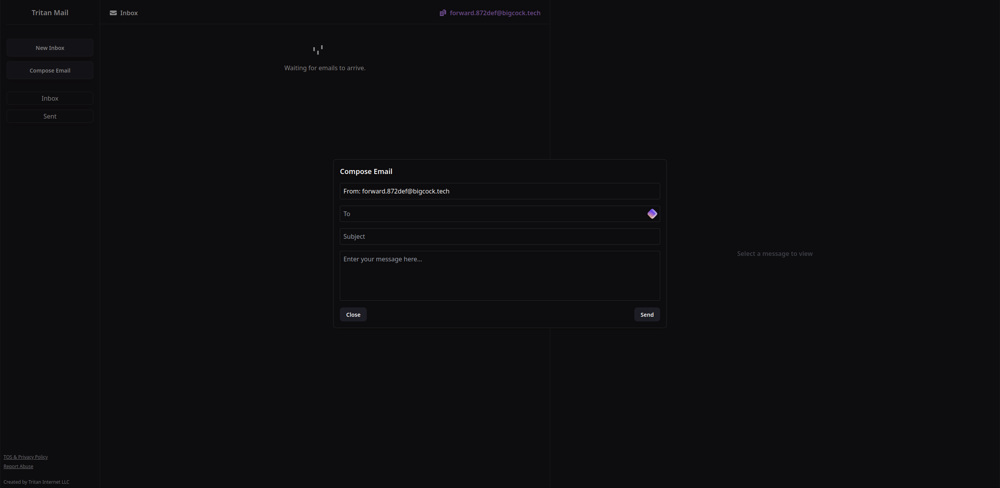
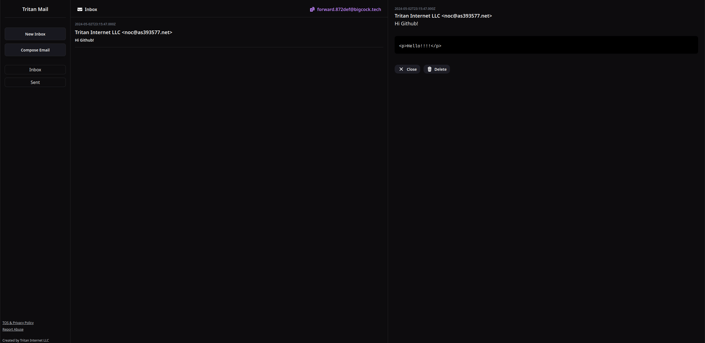
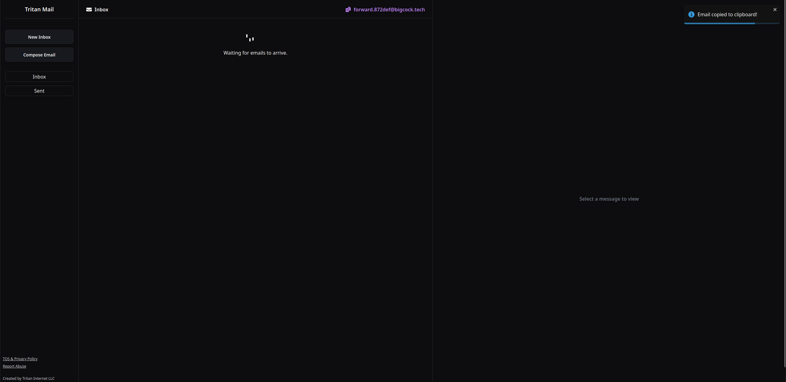

# Tritan Disposable Mail

Tritan Disposable Mail aims to change the temporary email experience by providing a user-friendly interface similar to a traditional inbox while offering the functionality of a temporary mail service. Unlike existing solutions, Tritan Temp Mail creates individualized inboxes rather than relying on catch-all emails, enhancing privacy and organization. 

This codebase also gives users the ability to send emails from their custom mailboxes, regenerate new addresses with the click of a button (literally), and view their sent emails in addition to deleting individual messages or their entire mailbox as a whole. Say goodbye to catch all temp mail services, yuck. 

Don't want to self host? You can use our hosted version, [here](https://mailbox.tritan.gg).

## Backend

The backend is built with Express and TypeScript. It uses custom made wrappers, such as `imap` for fetching emails, `smtp` for sending emails, and `mongoose` for interacting with MongoDB.

## Frontend

The frontend is built with Next.js and TypeScript. It uses Zustand for state management and Tailwind CSS for styling.

## Getting Started

1. Clone the repository: https://github.com/team-tritan/temp-mail

   ```bash
   git clone https://github.com/team-tritan/Disposable-Mail/

   # In the backend directory
   cd backend
   npm install

   # In the frontend directory
   cd ../frontend
   npm install

   ```

2. Edit the config files.

   - You will need to edit `backend/config.ts` and `frontend/next.config.js` for their appropriate values. To avoid messiness with changing from local to production env (since next is client side), we are proxying API requests using Next Rewrites. You will need to setup an Nginx proxy or something, then place that domain in the next rewrite section.

3. Start the application in dev mode:

   ```bash
   # In the backend directory
   npm run dev

   # In the frontend directory
   npm run dev
   ```

4. Auto build and run the application in production:
   - [Install docker](https://docs.docker.com/engine/install/) 
   - Run `sudo docker compose up -d`.

## Notes

- This project was specifically made to work with the Mailcow API for creating user accounts.

- The user authentication for email accounts is stored under local storage. If the connection is rejected, it will remove the auth and tell the user to refresh. If there is nothing in local storage, it creates the account and stores the tokens.

- To avoid sent mail abuse or any subpoenas, sent mail logs are stored in MongoDB. We're also planning on using MongoDB to set an expiration time for any temp mail accounts to automatically clean up the mail server. This is SoonTM.

- Once a mailbox is deleted, it is genuinely gone forever. The only data stored in the database is the time of creation, email auth, and sent messages.

## Contributing

Contributions are welcome! Please feel free to submit a pull request with any neat features.

## Developed by

Tritan Internet! We provide hosting and various services, you can visit our website [here](https://tritan.gg).

- [DylanJamesDev](https://github.com/dylanjamesdev)
- [WindowsCmd](https://github.com/WindowsCmd)
- [Fxx](https://github.com/devfxx)

## Support Us

You can [buy us a coffee](https://buymeacoffee.com/teamtritan) or [purchase hosting](https://tritan.gg).

## License

This project is licensed under the MIT License.

## Screenshots





